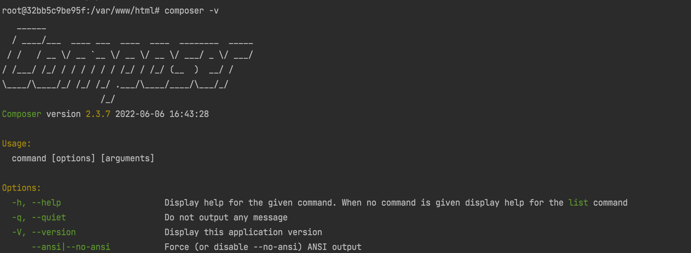

# Shopifyアプリの開発ハンズオン

## はじめに

- 当ドキュメントではShopifyアプリのことをアプリと呼びます
- 当ドキュメントの目的はアプリについての概要（講義）とハンズオン（実技）を通して、アプリで何ができるかを理解するとともに製作をスムーズに行えるようになることにあります
- ハンズオンで利用する言語はPHPです。そのほか、Dockerも利用します
- ハンズオンで localhost と 3000、4040のポートを利用しますので空けておいてください
- 質問のある場合は挙手お願いします（セクション間で質疑応答の時間は取りません）

## 概要

ここではアプリとは何なのか、利用することで何ができるのかを学習します。

### アプリとは

Shopifyアプリは、Shopifyの既存の機能を拡張するものです。
-- <cite>[What's a Shopify app?](https://shopify.dev/apps/getting-started#whats-a-shopify-app)</cite>

たとえば、オーダーを取得して独自にカスタマイズしたCSVに出力したり、顧客に新製品の発売の案内を送ったりすることができるようになります。

一般的な利用のフローは下記の通りです。


-- <cite>[What's a Shopify app?](https://shopify.dev/apps/getting-started#whats-a-shopify-app)</cite>

### アプリ制作のために必要なもの

- サーバー（ドメイン）
アプリを公開するために使います
- パートナーアカウント
アプリを作成するために使います
- 製作するためのスキル
そんなに難しい知識はいらないです。ここで学ぶことだけでOK

### アプリの種類

すべては[こちら](https://help.shopify.com/ja/manual/apps/app-types)に載っています。

アプリ作成画面では **公開アプリ（Public App）** か **カスタムアプリ（Custom App）** のどちらかを選択できます。

公開アプリを利用する場合は[審査](https://shopify.dev/apps/store/review?shpxid=66f6391d-3AB4-4932-95A3-4C0856227DA8)を受ける必要があり、アプリストアに公開して販売する場合はこちらを選択します。

カスタムアプリは公開アプリと違い、アプリストアへの公開はされません。インストールリンクを発行し、ストア管理者にインストールしてもらいます。

### アプリで利用できるAPIの種類

よく利用するであろうAPIのみ抜粋しました。 一部認証必要あり以外はトークンを利用すればかんたんに使用できます。

すべては[こちら](https://shopify.dev/apps/getting-started#how-your-app-accesses-shopify)から確認できます。認証については次の項で説明します。

|API名|何ができる？|認証が必要か？|APIの形式|
|---|---|---|---|
|[Admin API](https://shopify.dev/api/admin)|管理画面上から利用できるすべてを拡張できる。商品の追加・更新/顧客のデータを操作する/オーダーのデータを操作する...など。具体例としてはアマゾンで販売している商品が売れたらShopify上の在庫も減らす　など。|はい|GraphQL / REST|
|[ストアフロントAPI](https://shopify.dev/api/storefront)|フロントエンドにおけるどこでもShopify。Shopifyの商品情報を取得して描画したり、購入させたりなど購入体験をShopify以外の場所で実現できる|いいえ|GraphQL|
|[Ajax API](https://shopify.dev/api/ajax)|公開されたエンドポイントにリクエストして、戻った値をごにょごにょするような簡易なAPIです|いいえ|Ajax|

### 認証

アプリを利用するうえでキモとなってくるのが認可と認証です。


認証必須のAPIでは、認証を通したあとに要求に対するスコープ（権限）が認可されているかを確認されます。

ここで認可不足の判定を受けた場合、認証を通していても要求は拒否されてしまいます。

スコープの種類はすべて[こちら](https://shopify.dev/api/usage/access-scopes#authenticated-access-scopes)に載っています。

なお、一度認証を通したあとにスコープの変更を行いたい場合は再度認証を通すことで更新できます。

### アプリ画面の仕組み

インストールしたアプリの多くはShopify管理画面で操作することができますが、これは **iframe** 埋め込みによる描画です。


インストールしたアプリの操作画面の出力方法は2種類あり、

1. iframe埋め込み（Shopify管理画面上に描画する）
2. リダイレクト（Shopify管理画面から離れてアプリページに飛ぶ）

のどちらかです。どちらの挙動にするかはアプリの製作者側で設定できます。
<br><br>

少し話は戻りますが、[アプリ制作のために必要なもの](README.md#アプリ制作のために必要なもの) で「サーバー」を挙げていました。

これはiframeの表示 / リダイレクト先に指定するためで、 このことから
アプリのインストールというのはWordPressのプラグインのようなソースファイル一式をダウンロードするのではなく、
単に 外部サーバーにあるアプリケーションに認証をかけているだけ と考えられます。

外部サーバーを利用するということはリクエストの多さによってはアプリだけダウンしてしまう といったことも考えられますので、この点は注意が必要でしょう。

### 製作のフロー

アプリを制作するフローは下記の通りです。

1. Shopify Partnersに登録する
2. パートナー管理画面でアプリを作成する
3. 開発ストアを作成する
4. 作成したアプリのトークンとシークレットキーを利用して（必要あれば）開発ストアに認証を通す。そしてアクセストークンを得る
5. 開発する
6. （カスタムアプリの場合、インストールリンクを発行して）本番ストアにインストールする

## 顧客のデータを更新するアプリをつくってみよう

2022/6 現在、Shopifyには管理画面外から顧客のデータを更新する機能はありません。（顧客が変更したいと思っても変更できない）

この機能を実現するアプリを作成してみたいと思います。

### サーバーを用意する

[アプリ制作のために必要なもの](#アプリ制作のために必要なもの)の題で挙げたものを用意する必要があります。

パートナーアカウントはのちのステップで取得しますので、残りはサーバーのみ必要です。

今回はデモなので、Dockerで用意します。適当なディレクトリを用意して、そこまでcdしたあと下記のコマンドを実行します。

```
$ docker run --name test_shopify_app -p 3000:80 -v ${PWD}:/var/www/html -d php:8.0-apache
```

適当にindex.phpなど作成してみて、[localhost:3000](http://localhost:3000)にアクセスして表示されるか確認します。

これでサーバーは立ち上がりましたが、外部との通信は行えません。ngrokでこれを公開します。

```
$ docker run --rm -p 4040:4040 --link test_shopify_app -e NGROK_PORT="test_shopify_app" -e NGROK_AUTH="27m02PDatn2fLXwW0vmQvSdzL8m_6r1XEavqunxdcGDR9dLUt" wernight/ngrok
```

[localhost:4040](http://localhost:4040)にアクセスすると、下記の画面が表示されます。


画面中央に表示されているURLをクリックすると、[localhost:3000](http://localhost:3000)と同じものが表示されるはずです。

ハンズオンではこれをアプリサーバーとしてすすめます。


起動したら[localhost:3000](http://localhost:3000)にアクセスして、index.php

### Shopify Partnersに登録する

[Shopify Partners](https://www.shopify.com/partners) のトップページにアクセスします。


画面右上に Login / Join now がありますので、アカウント登録済みの場合は Login を。未登録の場合は Join now をクリックします。（アカウント作成してください）

### アプリを作成する

ログインしたら、アカウント管理画面トップ左ナビの「Apps」をクリックします。


アプリ画面右上の「Create app」をクリックします。


今回のアプリを公開する目的はないので、「Custom app」をクリックしてアプリの情報を入力します。


- アプリ名
好きなな名前を入力します
- アプリURL
ngrokのコンテナ生成時に発行したhttpsからはじまるURL
- リダイレクトURL
アプリをインストールして認証許可されたあとにリダイレクトされるURL。アクセストークンを返してくれるので、ここで取得して保存する

-- <cite>[The OAuth flow](https://shopify.dev/apps/auth/oauth#the-oauth-flow)</cite>

入力を終えたら右上の「Create app」をクリックします。


作成できました。

Api keys の Api key と Api secret key はあとで使いますので、控えておきます。

### アクセストークン取得の準備をする

今回はPHPを使用してアプリを開発しますので、docker環境にcomposerをインストールします。

まずはdocker環境の中に入ります。

```
$ docker exec -it test_shopify_app bash
```

[composerのダウンロード手順](https://getcomposer.org/download/)を参考にすすめます。

```
php -r "copy('https://getcomposer.org/installer', 'composer-setup.php');"
php -r "if (hash_file('sha384', 'composer-setup.php') === '55ce33d7678c5a611085589f1f3ddf8b3c52d662cd01d4ba75c0ee0459970c2200a51f492d557530c71c15d8dba01eae') { echo 'Installer verified'; } else { echo 'Installer corrupt'; unlink('composer-setup.php'); } echo PHP_EOL;"
php composer-setup.php
php -r "unlink('composer-setup.php');"
```

をそのまま貼り付けます。`composer.phar` ファイルのダウンロードを確認できます。

次に、ダウンロードしたファイルを移動させます。

```
mv composer.phar /usr/local/bin/composer
```

インストールできたか確認します。

```
composer -v
```



gitも必要ですので、インストールします。

```
apt-get update && apt-get install git
```

インストールできたか確認

```
git --version
```

composerを使って[PHP Shopify SDK](https://github.com/phpclassic/php-shopify)をインストールします。

```
composer require phpclassic/php-shopify
```

[サーバーを用意する](README.md#サーバーを用意する)で作成したindex.phpを下記に置き換えます。

```
<?php
require './vendor/autoload.php';

use PHPShopify\AuthHelper;
use PHPShopify\ShopifySDK;

new ShopifySDK([
    'ShopUrl' => 'aaaaaaa.myshopify.com',
    'ApiKey' => 'abcdef1234567890',
    'SharedSecret' => 'abcdef1234567890'
]);
AuthHelper::createAuthRequest('read_customers', 'https://5cfa-219-117-222-64.ngrok.io/redirect');
```

ShopifySDKの引数とAuthHelper第二引数のURLは変更します。
- ShopUrl
  作成したテストストアのURL
- ApiKey
  アプリ作成時に控えたAPIキー
- SharedSecret
  アプリ作成時に控えたシークレットキー

- AuthHelperの第二引数
  アプリのURL

次に、redirectディレクトリを作成し、中にindex.phpを作成します。index.phpには下記を書きます。

```
require '../vendor/autoload.php';

use PHPShopify\AuthHelper;
use PHPShopify\ShopifySDK;

new ShopifySDK([
    'ShopUrl' => 'xn-wbk4a2db6dnc.myshopify.com',
    'ApiKey' => '8ee69e5b421081c4047ebbf579ab74e1',
    'SharedSecret' => 'a7c928dc51d491c53159f8d82fc1b66e'
]);

$accessToken = AuthHelper::getAccessToken();

echo $accessToken;
```

### 開発ストアを作成、アプリをインストールしてアクセストークンを得る

アプリ画面の上部タブに「Test on development store」があります。


これをクリックします。


「Create new store」をクリックします。


項目にそって入力して、保存をクリックします。ストアの生成完了まで少し時間がかかりますので、待ちます。

ストアオーナーの情報を入力しろといわれるので、入力します。


ストアが作成されたら、左のナビから「Apps」のページに移動します。


カスタムアプリを許可するかと確認されますので、許可していきます。

次に、アプリ管理画面に戻ってインストールリンクを生成します。

「Generate Link」をクリックして、


確認を許可します。


生成した「Generate Link」にアクセスして、アプリをインストールします。


インストールが完了したら
自動的にredirectに移動して、アクセストークンが表示されます。

現在このアプリに与えられたスコープは顧客情報を確認するだけです。書き換え権限もほしいので、index.phpの最後の一文、第一引数にwrite_customersを追加します。

before
```
AuthHelper::createAuthRequest('read_customers', 'https://5cfa-219-117-222-64.ngrok.io/redirect');
```

after
```
AuthHelper::createAuthRequest('read_customers, write_customers', 'https://5cfa-219-117-222-64.ngrok.io/redirect');
```

変更したら今度は `https://5cfa-219-117-222-64.ngrok.io/`（ngrokのURLトップ） にアクセスします。


すると、アプリのスコープを更新するか確認されますので、許可します。ここで取得したアクセストークンは控えておきます。

### 顧客を作成する

ストア管理画面 左ナビのCustomersから顧客を作成します。


### 顧客情報変更のエンドポイントを作成する

アプリ開発側に戻って、apiディレクトリを作成して中にindex.phpを作成します。

```
<?php

require '../vendor/autoload.php';

use PHPShopify\ShopifySDK;

if (isset($_GET)) {
    $SDK = new ShopifySDK([
        'ShopUrl' => 'aaaaaa.myshopify.com',
        'AccessToken' => 'accessssssss'
    ]);
    
    if (isset($_GET['mail_before']) && isset($_GET['mail_after'])) {
        $customers = $SDK->Customer->get();
        if (is_array($customers)) {
            foreach ($customers as $customer) {
                if ($_GET['mail_before'] === $customer['email']) {
                    $SDK->Customer($customer['id'])->put([
                        'email' => $_GET['mail_after']
                    ]);
                }
            }
        }
    }
}
?>
```

### 顧客情報編集フォームを作成する

customer.php を トップの階層に作成します。

```
<form action="/api" method="get">
    <label>変更前のアドレス</label> <input name="mail_before" type="text"> <label>変更後のアドレス</label> <input name="mail_after"
                                                                                                  type="text">
    <button type="submit">送信</button>
</form>
```

### APIの動作を確認する

customer.php にアクセス後、変更前と変更後のメールアドレスを入力して送信しましょう。

変更前のアドレスと同じアドレスが顧客の中に存在すれば、変更後のアドレスに書き換えられます。


書き変わると履歴に残ります。以上でこのアプリの制作は終了です。色々カスタマイズしてみてください。


ちなみに、Shopifyフロント上にフォームを用意して、アプリ側で捕捉したいときがあるかと思います。

通常はCSRF（corsとかmo）などの観点からオープンにしておくのは・・・とか考えるとおもいます。

こういったときは[アプリプロキシ](https://shopify.dev/apps/online-store/app-proxies)を使ってください、

## さいごに

今回製作したアプリは穴だらけなので実運用できませんが、非常に簡単な手順で制作に望めるということがわかったかとおもいます。

Shopify既存の機能でうまくできないことはアプリを活用してみてください。以上！！